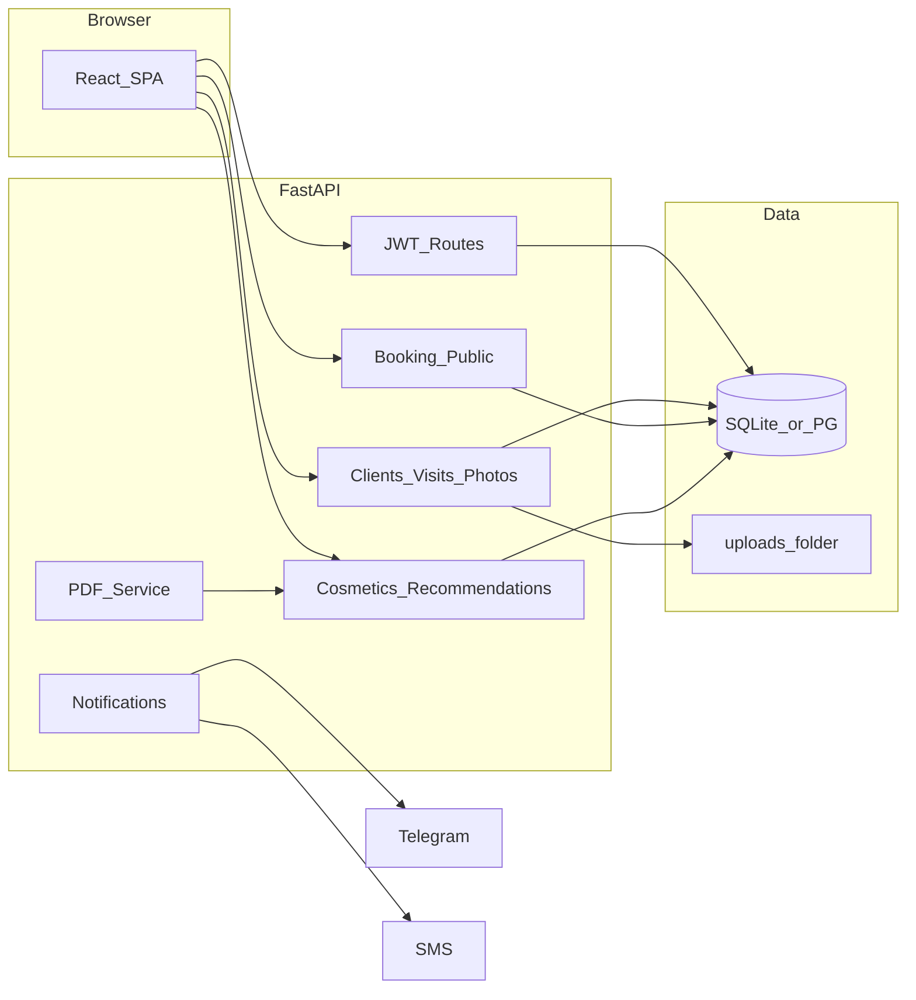

# BeautyTrack — план реализации MVP

## 1. Анализ [business.md](business.md)

**Продукт:** CRM для косметологов с упором на визуальный трекинг и смежные процессы.

**Полный охват ТЗ (для roadmap):** карточка клиента; галерея «до/после»; маска лица по ориентирам (FR-03); графики метрик по ИИ (FR-04); аннотации на фото; PDF прогресса; публичная запись 24/7 со слотами и блокировкой конфликтов; отмена/перенос за N часов; пакеты процедур; база средств (INCI, тип кожи, проблемы); топ-3 подбор; ручная правка врачом; PDF-схема ухода; учёт аллергий; свои продукты клиники; дашборд KPI; экспорт Excel/CSV; роли админ / врач / клиент.

**MVP из раздела 3 (граница релиза 1.0):**

- Профиль клиента + галерея фото, **только ручное сравнение** (без FR-03/FR-04 в первой итерации).
- Онлайн-запись с календарём **без пакетов** (FR-12 вне MVP).
- Напоминания **SMS + Telegram** (в MVP: рабочий Telegram через Bot API + SMS через конфигурируемый провайдер или режим «mock» для разработки).
- База косметики (~100 позиций: сиды + ручной ввод врачом).
- **PDF-схема ухода** (FR-21 в объёме MVP).

**Роли (FR-27):** обязательны в MVP — администратор, врач (свои клиенты/слоты), клиент (только свои данные и записи).

Итог: в первой версии сознательно **не** делаем: выравнивание лиц по landmarks, ИИ-метрики, аннотации на фото, пакеты записей, предзаполненная анкета по ссылке (FR-11), полный дашборд KPI и экспорты (FR-25/26) — их можно заложить в схему БД и API как расширения.

---

## 2. Стек (простой и распространённый)

| Слой | Технология | Зачем |
|------|------------|--------|
| API | **FastAPI** + **Pydantic v2** | Асинхронность, автодокументация OpenAPI, стандарт для Python. |
| ORM / миграции | **SQLAlchemy 2** + **Alembic** | Предсказуемая модель данных. |
| БД | **SQLite** (файл в репо/dev) с опцией **PostgreSQL** через `DATABASE_URL` | Минимум инфраструктуры для лабораторной работы; прод — одна переменная окружения. |
| Auth | **JWT** (access), пароли **bcrypt** (passlib), зависимости FastAPI `Security` | Без лишних SaaS. |
| Файлы | Локальная папка `uploads/` + раздача через nginx в проде или статический mount в dev | Без S3 на MVP. |
| PDF | **WeasyPrint** или **fpdf2** | Схема ухода в PDF; WeasyPrint удобнее для HTML→PDF, fpdf2 проще по зависимостям — выбор при реализации по окружению (на macOS WeasyPrint обычно ок). |
| Telegram | **httpx** вызовы `api.telegram.org` | Без лишних обёрток. |
| SMS | Интерфейс + реализация **Mock** + опционально **Twilio** по env | Лаба без платежей — mock по умолчанию. |
| UI | **React 18** + **Vite** + **TypeScript** + **Tailwind CSS** + **shadcn/ui** (Radix) | Современный вид, много готовых паттернов, один стек для форм/календаря/таблиц. |
| HTTP клиент | **TanStack Query** + **fetch/axios** | Кэш и состояние загрузки к API. |

Структура монорепо: `backend/` и `frontend/` в корне [sabisha](sabisha).

---

## 3. Архитектура (MVP)

**Конфликты записей (FR-09):** транзакция при создании записи: `SELECT ... FOR UPDATE` (PostgreSQL) или короткая критическая секция + уникальный индекс на `(doctor_id, start_at)` при фиксированных слотах; для SQLite — уникальность интервалов проверять в одной транзакции с `BEGIN IMMEDIATE`.

**Публичная запись (FR-07/08):** отдельные эндпоинты без полной сессии кабинета: `GET /public/booking/{clinic_slug}` + выбор процедуры/врача/слотов; после записи — опционально JWT «client scoped» или магическая ссылка с токеном для отмены/переноса (FR-10).

---

## 4. Модель данных (ядро сущностей)

- `User` (email, hashed_password, role: admin | doctor | client), связь `ClientProfile` для роли client.
- `DoctorProfile` (user_id, рабочие часы JSON или нормализованная таблица `WorkingHours`).
- `Client` (ФИО, дата рождения, телефон, email, аллергии, противопоказания, owner_doctor_id или общий пул для админа — уточнить правило видимости: **врач видит только своих клиентов**, админ — всех).
- `Visit` (client_id, дата, комментарий), `VisitPhoto` (до N=10 файлов на визит, порядок, тип before/after по желанию).
- `Procedure` (название, длительность мин, перерыв после — для слотов).
- `Appointment` (doctor_id, client_id или гость-поля, procedure_id, start, end, status, cancellation_token).
- `Product` (название, INCI, skin_types[], concerns[], contraindications text, clinic_custom bool).
- `CarePlan` / `CarePlanItem` (утро/вечер, порядок, частота) + связь с подобранными продуктами после правки врачом.

Сиды: ~100 продуктов (упрощённые поля, достаточные для демо).

---

## 5. Эндпоинты (логические группы)

- `/auth/register`, `/auth/login`, `/auth/me`
- `/clients`, `/clients/{id}/visits`, загрузка фото multipart
- `/doctors`, `/doctors/{id}/schedule` (шаблон), `/appointments` (CRUD с ролями), `/public/...` для слотов и брони
- `/products`, `/recommendations` (ввод: тип кожи + проблемы + client_id для аллергий), PATCH ручной корректировки
- `/care-plans/{id}/pdf` — отдача PDF
- `/notifications/test` (admin) — проверка Telegram

---

## 6. UI (современный, без переусложнения)

- **Лендинг / вход** — спокойная палитра (нейтральный фон + один акцент), типографика (например **Inter**).
- **Кабинет врача:** список клиентов, карточка клиента, вкладки «Профиль», «Визиты и фото» (сетка, lightbox, рядом два снимка для ручного сравнения), «Запись», «Уход» (подбор + таблица + кнопка PDF).
- **Публичная запись:** пошаговый мастер (процедура → врач → дата/слот → контакты).
- **Админ:** пользователи/врачи, справочник процедур, просмотр записей, настройка N часов для отмены.

Использовать готовые компоненты shadcn: `Button`, `Card`, `Dialog`, `Tabs`, `Calendar` (или сторонний календарь на Radix), `Table`, `Form` + react-hook-form + zod.

---

## 7. Порядок разработки (итерации)

1. **Скелет:** репо `backend` + `frontend`, Docker Compose **опционально** (можно обойтись venv + `npm run dev`), `.env.example`.
2. **БД и auth:** модели User/Role, JWT, защищённые роуты.
3. **Клиенты и визиты:** CRUD + загрузка фото + лимит 10 + галерея в UI.
4. **Процедуры и расписание:** шаблон часов врача, генерация свободных слотов на сервере.
5. **Записи:** внутренний календарь + публичная страница + блокировка + отмена/перенос с проверкой окна N часов (настройка в `ClinicSettings` или env).
6. **Косметика:** модель, сиды, форма добавления врачом, rule-based топ-3 + фильтр по аллергиям (простое вхождение подстроки INCI/названия — достаточно для MVP).
7. **PDF-схема ухода** из утверждённого плана.
8. **Уведомления:** очередь «на завтра» упрощённо — **APScheduler** или cron-скрипт + вызов Telegram; SMS mock/ Twilio.
9. **Полировка:** валидация, ошибки API в UI, README с запуском.

---

## 8. Риски и упрощения

- **FR-03 (маска лица):** вне MVP; при необходимости позже — MediaPipe Face Mesh в отдельном сервисе или на клиенте.
- **FR-04 (ИИ-графики):** вне MVP.
- **FR-25/26:** в MVP — только простые счётчики на главной (кол-во записей за период) без полноценного BI/Excel — при желании добавить `openpyxl` одним эндпоинтом позже.

---

## 9. Критерий готовности MVP

- Три роли работают с разной видимостью данных.
- Клиент создан, к визиту приложены фото, в UI можно вручную сравнить два снимка.
- Публичная запись создаёт appointment без пересечений; отмена/перенос уважают N часов.
- Из базы ≥100 продуктов (сиды) rule-based подбор топ-3 с учётом аллергий (простая логика), врач правит список, PDF скачивается.
- Telegram-уведомление уходит при тестовом событии; SMS в mock или с ключом Twilio.

После вашего подтверждения плана можно переходить к реализации в репозитории (создание `backend/`, `frontend/`, миграций и UI по шагам выше).
