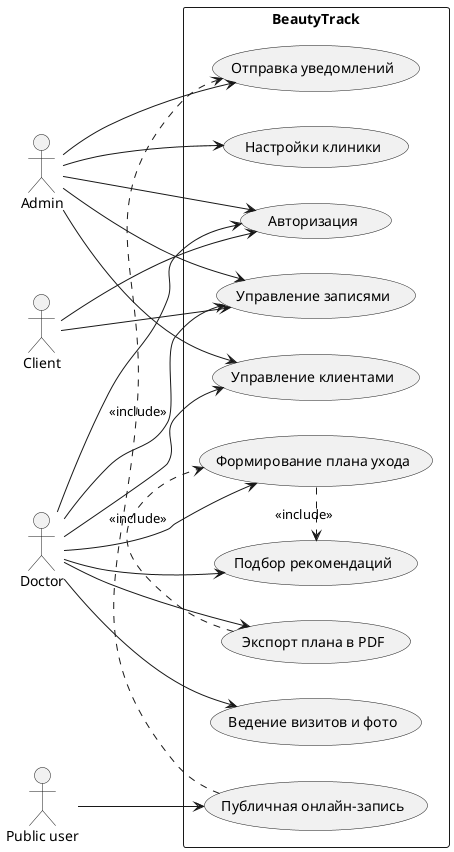
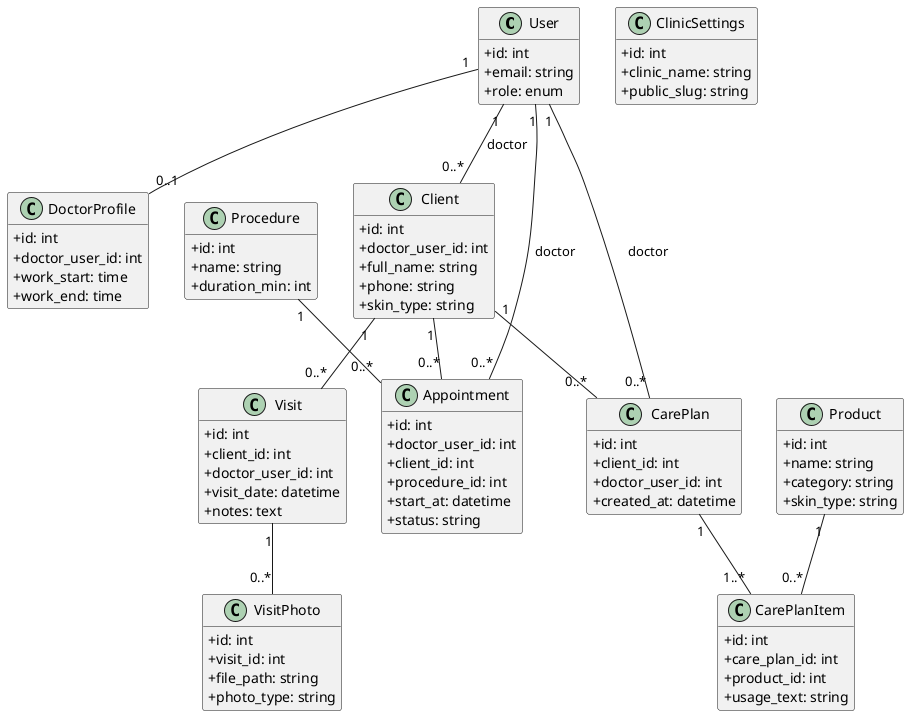
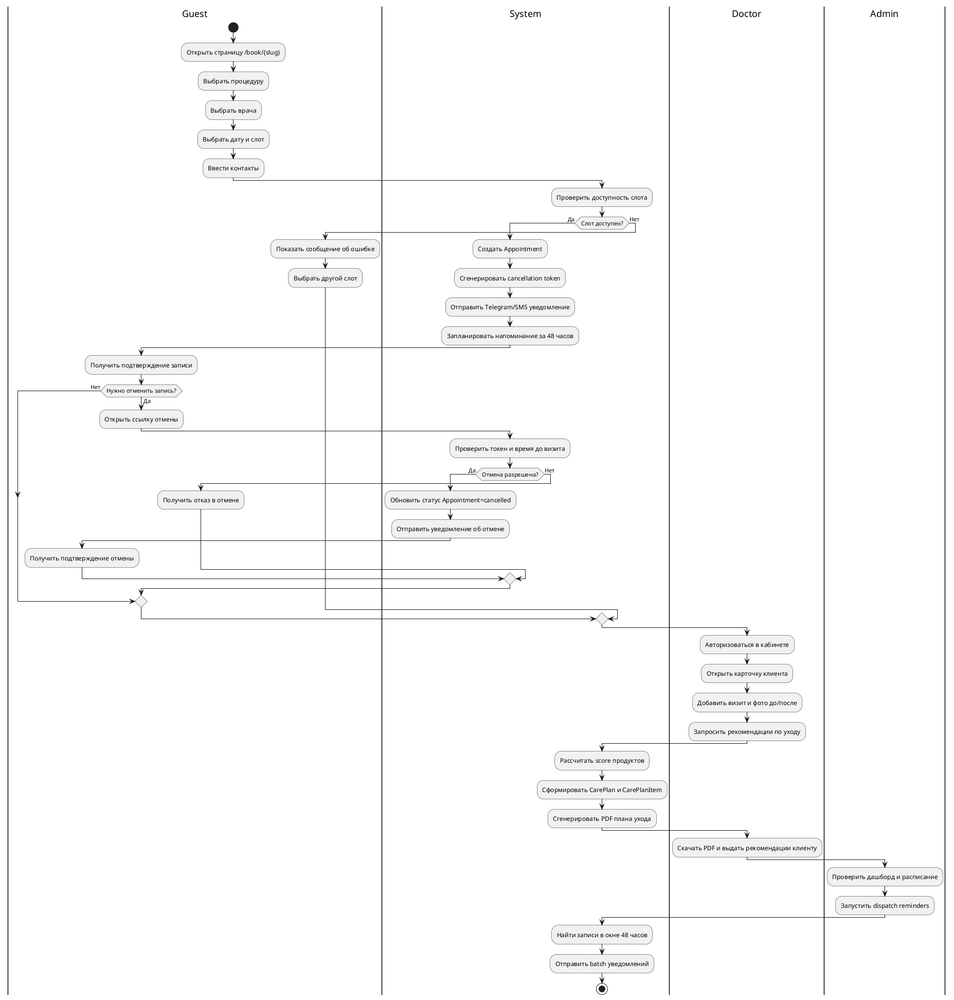
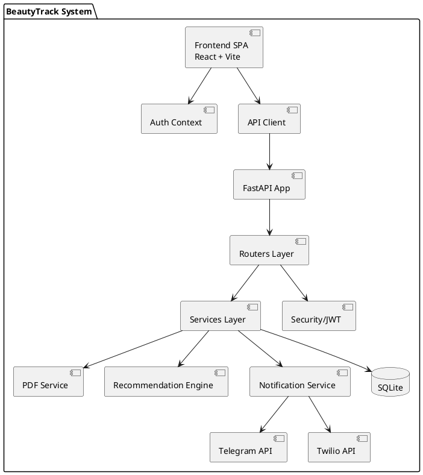
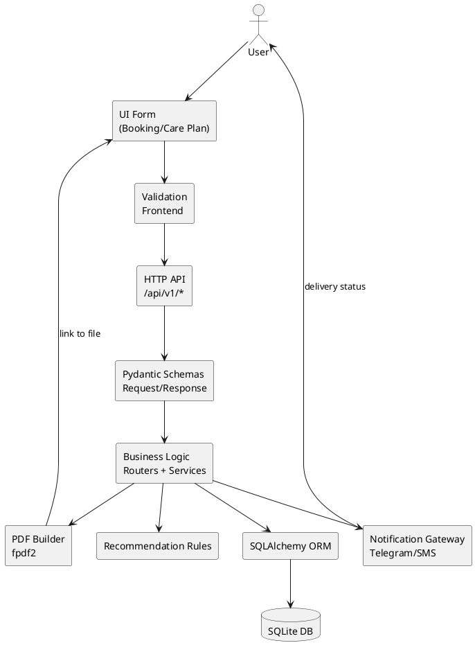
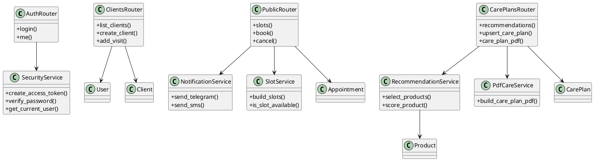
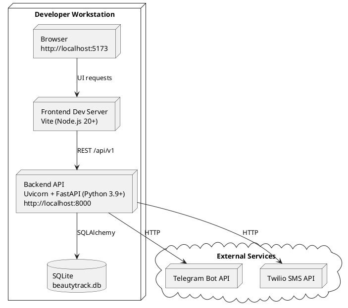

# Диаграммы BeautyTrack (PlantUML)

## 1) Диаграмма вариантов использования

## 2) Доменная модель предметной области

## 3) BPMN-схема процессов

## 4) Диаграмма компонентов

## 5) Компонентая диаграмма обработки данных

## 6) UML диаграмма классов

## 7) Диаграмма развертывания

